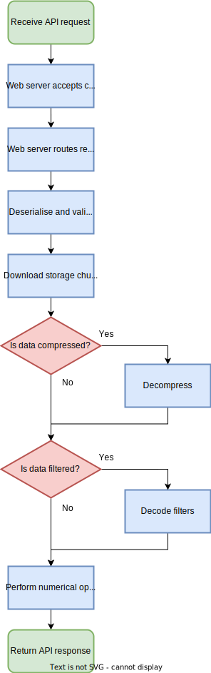
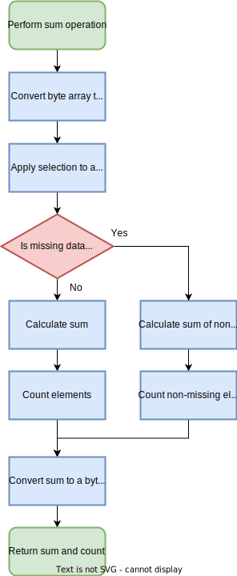

# Architecture and implementation

Reductionist is written in [Rust](https://www.rust-lang.org/), a language that is rapidly gaining popularity for a variety of use cases.
It provides high level abstractions with low runtime overhead, a modern toolchain, and has a unique approach that provides safe automatic memory management without garbage collection.
While the Rust standard library is not as comprehensive as some other "batteries included" languages, the [crates.io](https://crates.io/) ecosystem is relatively mature and provides a number of de-facto standard libraries.
Reductionist is built on top of a number of popular open source components.

A few properties make it relatively easy to build a conceptual mental model of how Reductionist works.

- All operations share the same request processing pipeline.
- The request processing pipeline for each request is a fairly linear sequence of steps.
- There is no persistent state.
- The only external service that is interacted with is the object store, either HTTP(s) or S3 compatible.

The more challenging aspects of the system are the lower level details of asynchronous programming, memory management, the Rust type system and working with multi-dimensional arrays.

A diagram of the request processing pipeline is shown in Figure 1.

<figure markdown>
  
  <figcaption>Figure 1: Request processing pipeline flow diagram</figcaption>
</figure>

The "Perform numerical operation" step depends on the type of numerical operation being performed.
A diagram of this step for the sum operation is shown in Figure 2.

<figure markdown>
  
  <figcaption>Figure 2: Sum operation flow diagram</figcaption>
</figure>

## Axum web server

[Axum](https://docs.rs/axum) is an asynchronous web framework that performs well in [various benchmarks](https://github.com/programatik29/rust-web-benchmarks/blob/master/result/hello-world.md) and is built on top of various popular components, including the [hyper](https://hyper.rs/) HTTP library.
It integrates well with [Tokio](https://tokio.rs/), the most popular asynchronous Rust runtime, and allows us to easily define an API route for each operation.
[Extractors](https://docs.rs/axum/latest/axum/extract/index.html) make it easy to consume data from the request in a type-safe way.
The operation request handler is the `operation_handler` function in `src/app.rs`.

## API request data

The JSON request data is deserialised into the `RequestData` struct defined in `src/models.rs` using the [serde](https://serde.rs/) library.
Serde handles conversion errors at the type level, while further validation of request data invariants is performed using the [validator](https://crates.io/crates/validator) crate.

## S3 object download

Object data is downloaded from the object store using the [AWS SDK](https://docs.aws.amazon.com/sdk-for-rust/).
The `S3Client` struct in `src/s3_client.rs` provides a simplified wrapper around the AWS SDK.
Typically we will be operating on a "storage chunk", a hyperslab within the larger dataset that the object contains.
In this case a byte range is specified in the S3 `GetObject` request to avoid downloading the whole object.
The AWS SDK is asynchronous and does provide a streaming response, however we read the whole storage chunk into memory to simplify later stages of the pipeline.
Storage chunks are expected to be small enough (O(MiB)) that this should not be a problem.

Construction of [aws_sdk_s3::Client](https://docs.rs/aws-sdk-s3/latest/aws_sdk_s3/client/struct.Client.html) structs is a relatively slow task.
A key performance improvement involves the use of a shared client object for each combination of object store URL and credentials.
This is implemented using the `S3ClientMap` in `src/s3_client.rs` and benchmarked in `benches/s3_client.rs`.

Downloaded storage chunk data is returned to the request handler as a [Bytes](https://docs.rs/bytes/latest/bytes/struct.Bytes.html) object, which is a wrapper around a `u8` (byte) array.

## HTTP(s) object download

Object data may also be downloaded from any HTTP server using the [reqwest HTTP client](https://docs.rs/reqwest/latest/reqwest/).
As with the S3 object download we will typically be operating on a "storage chunk" within the larger dataset that the object contains, so the HTTP server must support range request.

This is achieved using the `ChunkDownloader` trait defined in `src/chunk_store.rs`.

```rust
/// Chunk downloader trait.
///
/// # Methods
/// * `is_authorised`: Check if access is authorised.
/// * `download`: Download the requested data.
pub trait ChunkDownloader<'a> {
    /// Are we authorized to access the data?
    ///
    /// Returns true if authorized, false otherwise.
    ///
    /// # Arguments
    ///
    /// * `auth`: Optional authorization header
    /// * `request_data`: RequestData object for the request
    fn is_authorised(
        &self,
        auth: &Option<TypedHeader<Authorization<Basic>>>,
        request_data: &models::RequestData,
    ) -> impl std::future::Future<Output = Result<bool, ActiveStorageError>>;

    /// Download requested data.
    ///
    /// Returns bytes.
    ///
    /// # Arguments
    ///
    /// * `auth`: Optional authorization header
    /// * `request_data`: RequestData object for the request
    /// * `resource_manager`: ResourceManager object
    /// * `mem_permits`: Memory permits for the request
    fn download(
        &self,
        auth: &Option<TypedHeader<Authorization<Basic>>>,
        request_data: &models::RequestData,
        resource_manager: &ResourceManager,
        mem_permits: Option<SemaphorePermit<'a>>,
    ) -> impl std::future::Future<Output = Result<Bytes, ActiveStorageError>>;
}
```

## Object caching

A cache can be optionally enabled to store downloaded data chunks to disk, this allows the Reductionist to repeat operations on already downloaded data chunks utilising faster disk I/O over network I/O.

Authentication is passed through to the object store and access to cached data by users other than the original requestor is allowed if authentication permits. This authentication request can add an undesired overhead negating the efficiency of caching data and so can be optionally disabled for further cache speedup in trusted environments.
A second authentication option stores cached chunks per user providing a faster authenticated cache.

A [Tokio MPSC channel](https://docs.rs/tokio/latest/tokio/sync/mpsc/index.html) bridges write access between the requests of the asynchronous [Axum](https://docs.rs/axum) web framework and synchronous writes to the disk cache; this allows requests to the Reductionist to continue unblocked along their operation pipeline whilst being queued for cache storage.

The disk cache can be managed overall by size and by time to live (TTL) on individual data objects with automatic pruning removing expired objects. Cache state is maintained on-disk allowing the cache to be reused across restarts of the Reductionist server.

## Filters and compression

When a variable in a netCDF, HDF5 or Zarr dataset is created, it may be compressed to reduce storage requirements.
Additionally, prior to compression one or more filters may be applied to the data with the aim of increasing the compression ratio.
When consuming such data, Reductionist needs to reverse any compression and filters applied.
The filter pipeline is implemented in `src/filter_pipeline.rs`.

First, if a compression algorithm is specified in the request data, the storage chunk is decompressed using the same algorithm.
Currently the Gzip and Zlib algorithms are supported using the [flate2](https://docs.rs/flate2) and [zune-inflate](https://docs.rs/zune-inflate) libraries respectively.
This mix of libraries was chosen based on performance benchmarks in `benches/compression.rs`.
Compression is implemented in `src/compression.rs`.

Next, if any filters are specified in the request data, they are decoded in reverse order.
Currently the byte shuffle filter is supported.
This filter reorders the data to place the Nth bytes of each data value together, with the aim of grouping leading zeroes.
The shuffle filter is implemented in `src/filters/shuffle.rs`, and has several optimisations including loop unrolling that were benchmarked using `benches/shuffle.rs`.

## The Operation trait

Here the implementation becomes specific to the requested operation (min, max, etc.).
This is achieved using the `Operation` trait defined in `src/operation.rs`.

```rust
/// Trait for active storage operations.
///
/// This forms the contract between the API layer and operations.
pub trait Operation {
    /// Execute the operation.
    ///
    /// Returns a [models::Response](crate::models::Response) object with response data.
    ///
    /// # Arguments
    ///
    /// * `request_data`: RequestData object for the request
    /// * `data`: [`Vec<u8>`] containing data to operate on.
    fn execute(
        request_data: &models::RequestData,
        data: Vec<u8>,
    ) -> Result<models::Response, ActiveStorageError>;
}
```

This interface accepts the request data and a byte array containing the storage chunk data in its original byte order.
On success, it returns a `Response` struct which contains a byte array of the response data as well as the data type, shape and a count of non-missing elements in the array.

A second `NumOperation` trait with an `execute_t` method handles the dynamic dispatch between the runtime data type in the request data and the generic implementation for that type.

## Operations

Each operation is implemented by a struct that implements the `NumOperation` trait.
For example, the sum operation is implemented by the `Sum` struct in `src/operations.rs`.
The `Sum` struct's `execute_t` method does the following:

- Zero copy conversion of the byte array to a multi-dimensional [ndarray::ArrayView](https://docs.rs/ndarray/latest/ndarray/type.ArrayView.html) object of the data type, shape and byte order specified in the request data
- If a selection was specified in the request data, create a sliced `ndarray::ArrayView` onto the original array view
- Checks whether the reduction should be performed over all or only a subset of the sliced data's axes
- Performs a fold over each of the requested axes to calculate the required reduction while ignoring any specified missing data
- Convert the sum to a byte array and return with the element count

The procedure for other operations varies slightly but generally follows the same pattern.

## Error handling

The `ActiveStorageError` enum in `src/error.rs` describes the various errors that may be returned by the Reductionist API, as well as how to format them for the JSON error response body.
Low-level errors are converted to higher-level errors and ultimately wrapped by `ActiveStorageError`.
This is a common pattern in Rust and allows us to describe all of the errors that a function or application may return.

## Configuration

Reductionist configuration is implemented in `src/cli.rs` using the [clap](https://docs.rs/clap) library, and accepts command line arguments and environment variables.

## Resource management

Reductionist supports optional restriction of resource usage.
This is implemented in `src/resource_manager.rs` using [Tokio Semaphores](https://docs.rs/tokio/latest/tokio/sync/struct.Semaphore.html).
This allows Reductionist to limit the quantity of various resources used at any time:

- S3 connections
- memory used for numeric data (this is more of a rough guide than a perfect limit)
- threads used for CPU-bound work

## CPU-bound work

There is particular friction between the asynchronous and synchronous types of work in the system.
Axum and Tokio very efficiently handle the asynchronous aspects such as the HTTP server and S3 object download.
The other work such as decompression, filtering and numerical operations are more CPU-bound, and can easily block the Tokio runtime from efficiently handling asynchronous tasks.
Two alternative methods were developed to alleviate this issue.

1. The resource manager can limit the number of threads used for CPU-bound work, by default leaving one CPU core free for handling asynchronous tasks.
2. Integration with [Rayon](https://docs.rs/rayon), a library that provides a thread pool.

Limited benchmarking was done to compare the two approaches, however the first appeared to have lower overhead.
The second approach may leave the server more responsive if more CPU-heavy operations are used in future.

## Monitoring

Prometheus metrics are implemented in `src/metrics.rs` and are exposed by the Reductionist API under the `/metrics` path.
These include:

- incoming requests (counter)
- outgoing response (counter)
- response time (histogram)

## Tracing and profiling

Reductionist integrates with Jaeger, a distributed tracing platform.
Various sections of the request processing pipeline are instrumented with spans, making it easy to visualise the relative durations in the Jaeger UI.
Testing with a sum over some CMIP6 temperature data, this showed that in terms of wall clock time, the S3 storage chunk download takes the majority of the time, followed by decompression, byte shuffle, and finally the actual numerical operation.

Flame graphs created using [flamegraph-rs](https://docs.rs/flamegraph/) were useful to visualise which parts of the code consume the most CPU cycles.
This was useful to determine where to focus performance improvements, and showed that decompression is the most CPU-heavy task.
